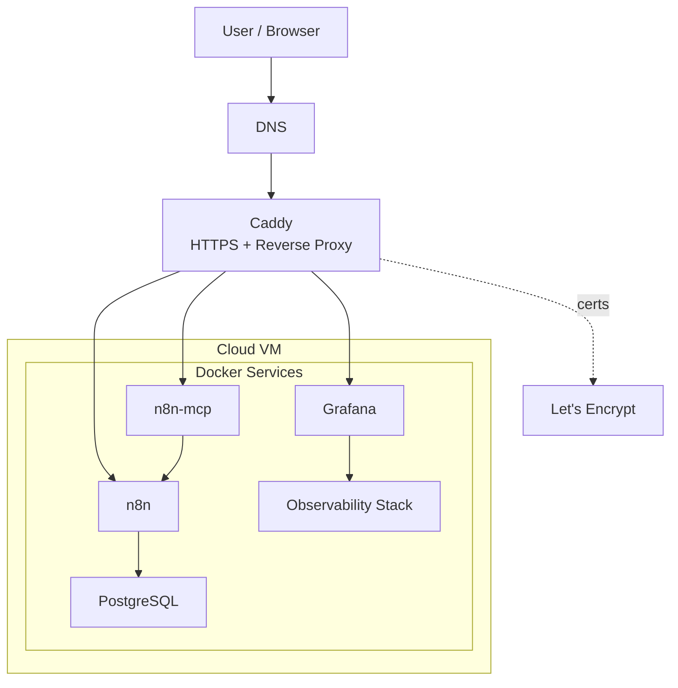

# Lab Infra

Personal self-hosted engineering platform for building and operating applied automation, analytics, and observability in a cloud setup.
Primary goals:
- develop automation workflows
- run analytical experiments
- operate production-like infrastructure
- build reproducible engineering artifacts

## 1. Architecture

- `n8n.samandrey.work` → `Caddy` → `n8n`
- `n8n-tech.samandrey.work` → `Caddy` → `n8n` (incoming webhooks / `WEBHOOK_URL`)
- `n8n-mcp.samandrey.work` → `Caddy` → `n8n-mcp`
- `grafana.samandrey.work` → `Caddy` → `oauth2-proxy-grafana` → `Grafana`
- `https://n8n.samandrey.work/rest/oauth2-credential/callback` → `Caddy` → `n8n`

| Service           | Port | Purpose                            |
| ----------------- | ---: | ---------------------------------- |
| **n8n**           | 5678 | orchestration automation workflows |
| **n8n-mcp**       | 3000 | MCP server for AI-assisted n8n workflows |
| **Grafana**       | 3000 | dashboards / UI                    |
| **Prometheus**    | 9090 | host/container metrics storage     |
| **Loki**          | 3100 | log storage                        |
| **Node Exporter** | 9100 | host metrics collection            |
| **cAdvisor**      | 8080 | container metrics collection       |
| **PostgreSQL**    | 5432 | operational and analytical storage |
| **Promtail**      |      | log collection                     |
All services run via Docker Compose.

Service interactions:
- n8n uses PostgreSQL as its primary persistence layer
- n8n-mcp uses the n8n API over the internal Docker network
- Prometheus scrapes metrics from Node Exporter, cAdvisor, and n8n
- Grafana uses Prometheus and Loki as data sources
- Promtail collects Docker logs and sends them to Loki
Persistent data is stored in Docker volumes.

## 2. Quick Start

```bash
git clone <repo>
cd lab-infra
cp .env.example .env # fill required variables
docker compose up -d

# regenerate (or verify) the client-side MCP configs in mcp/rendered/
python3 scripts/render-mcp-configs.py --check
```

The MCP client layer is stdlib-only; `--check` must pass right after clone.
See `mcp/README.md` for the management-layer design and how to wire
clients (Cowork, Codex) to the rendered configs.

Verification:
```bash
- infrastructure:
    - docker compose ps
    - docker logs ...
- external:
	# Проверка DNS (первый шаг!)  
	nslookup n8n.samandrey.work  
	nslookup n8n-mcp.samandrey.work  
	nslookup grafana.samandrey.work  
	  
	# Проверка через Caddy локально (без DNS)  
	curl -vk --resolve n8n.samandrey.work:443:127.0.0.1 https://n8n.samandrey.work  
	curl -vk --resolve n8n-mcp.samandrey.work:443:127.0.0.1 https://n8n-mcp.samandrey.work/health  
	curl -vk --resolve grafana.samandrey.work:443:127.0.0.1 https://grafana.samandrey.work  
	  
	# Проверка backend (внутри docker)  
	docker exec lab-caddy wget -qO- http://n8n:5678 | head  
	docker exec lab-caddy wget -qO- http://n8n-mcp:3000/health  
	docker exec lab-caddy wget -qO- http://grafana:3000 | head
- internal:
    - docker exec ... wget http://n8n:5678
    - curl http://localhost:9090/-/healthy
    - curl http://localhost:3100/ready
```

## 3. Access Model

**Cloud access:**
- `http://104.248.41.116`
- ssh root@104.248.41.116
- ssh root@lab-do

**Domains**:
- `n8n.samandrey.work`
- `n8n-tech.samandrey.work` (`WEBHOOK_URL` for incoming n8n webhooks)
- `n8n-mcp.samandrey.work` (`n8n-mcp` endpoint; MCP clients use the `/mcp` path)
- `grafana.samandrey.work`

**Google OAuth:**
- Google OAuth is used in two different roles:
	- for UI login via oauth2-proxy
	- for credentials within n8n
- these are two different OAuth flows
- for credentials within n8n, the callback path /rest/oauth2-credential/callback should not be intercepted by oauth2-proxy


**PostgreSQL**
- Internal access: Docker network (n8n → postgres)
- External access: SSH tunnel only
- Direct public access to PostgreSQL is disabled
- Local access (via SSH tunnel):
	- localhost:15432 → server localhost:5432

## 4. Data Model

PostgreSQL runs inside Docker container (`lab-postgres`).
PostgreSQL data is stored in Docker volumes (persistent storage).
**Databases**:
- `n8n` — service database
- `career_upgrade_lab` — analytical database
**Storage**:
- PostgreSQL → Docker volume
- backups → `/opt/backups/postgres`

## 5. Backup Policy

- schedule: daily (cron)
	- databases backup
	- local git snapshot of the working tree
- retention: 7 days
- location: `/opt/backups/postgres`
The repository safety script does **not** push to any remote. It records local-only recovery snapshots on branch `auto-snapshots`.
**Manual backup**:
```bash
./scripts/backup-postgres.sh
./scripts/git-auto-commit.sh
```

## 6. Repository Structure

```text
├── README.md
├── caddy
│   └── Caddyfile
├── docker-compose.yml
├── docs
│   └── RUNBOOK.md
├── monitoring
│   ├── loki
│   │   └── config.yml
│   ├── prometheus
│   │   └── prometheus.yml
│   └── promtail
│       └── config.yml
└── scripts
    ├── backup-postgres.sh
    └── git-auto-commit.sh
```

## 7. Configuration

All environment variables are defined in `.env`.
Template:
```env
POSTGRES_USER=admin
POSTGRES_PASSWORD=<pass>
POSTGRES_DB=n8n

GRAFANA_ADMIN_USER=admin
GRAFANA_ADMIN_PASSWORD=<pass>

GOOGLE_OAUTH_CLIENT_ID=<google-oauth-client-id>
GOOGLE_OAUTH_CLIENT_SECRET=<secret>

OAUTH2_PROXY_GRAFANA_COOKIE_SECRET=<secret>
ALLOWED_EMAIL=<your-email@example.com>

SERVER_IP=<YOUR_SERVER_IP>

N8N_ENCRYPTION_KEY=<key>
N8N_MCP_API_KEY=<n8n-api-key-from-settings-api>
N8N_MCP_AUTH_TOKEN=<generate-32-plus-char-random-token>
N8N_MCP_LOG_LEVEL=info
```
Do not commit `.env`.

## 8. Operations

Operational procedures are described in:
`docs/RUNBOOK.md`
Includes:
- health checks
- restart procedures
- logs inspection
- backup and restore
- `n8n-mcp` setup, smoke-test, and image-pin procedure

## 9. Versions and Upgrade Policy

All container images are pinned to exact `major.minor.patch` tags in `docker-compose.yml`. No `:latest`, no moving tags. A container restart (reboot, OOM, Docker daemon reload, full VM rebuild from the repo) always returns the same image that was tested — never a surprise new release.

### Pinned versions (as of 2026-04-21)

| Service       | Image                                    | Tag        |
|---------------|------------------------------------------|------------|
| n8n           | `n8nio/n8n`                              | `2.11.4`   |
| n8n-mcp       | `ghcr.io/czlonkowski/n8n-mcp/n8n-mcp`    | `latest`   |
| postgres      | `postgres`                               | `15.17`    |
| caddy         | `caddy`                                  | `2.11.2`   |
| grafana       | `grafana/grafana-oss`                    | `10.2.3`   |
| oauth2-proxy  | `quay.io/oauth2-proxy/oauth2-proxy`      | `v7.15.1`  |
| prometheus    | `prom/prometheus`                        | `v3.10.0`  |
| loki          | `grafana/loki`                           | `3.0.0`    |
| promtail      | `grafana/promtail`                       | `3.0.0`    |
| node-exporter | `prom/node-exporter`                     | `v1.10.2`  |
| cadvisor      | `gcr.io/cadvisor/cadvisor`               | `v0.55.1`  |

The `v` prefix matches the vendor's own tag scheme on the registry — some projects use it (prom/*, cadvisor, oauth2-proxy), others don't (n8n, postgres, caddy, grafana, loki).

Temporary exception: `n8n-mcp` currently uses the published GHCR path with `:latest` during the initial rollout. After the first stable usage cycle, switch it to a digest pin for reproducibility.

### Upgrade policy: MANUAL, per service

Images are **not** auto-upgraded. Running `docker compose pull` without a tag change is intentionally a no-op. To upgrade a service:

1. Review the upstream changelog / release notes for the target version. Check for breaking changes (auth schema, config format, DB migrations).
2. Edit the tag in `docker-compose.yml` in a focused commit (`chore(deps): bump <service> X -> Y`, with the changelog link in the commit body).
3. `docker compose pull <service>` — fetch the new image.
4. `docker compose up -d <service>` — restart only that service.
5. Verify: service health check, UI login, a sanity workflow run, relevant logs clean.
6. On regression: revert the tag in git, `docker compose up -d <service>` to roll back.

Security patches: watch the upstream release pages (GitHub releases, CVE feeds) for each pinned version. Apply on review, not automatically.

**Why not `:latest`**: an automatic pull on restart can pick up a new major, break auth/UI/schema, and leave the platform in an unbootable state with no correlation to when the breakage started. Pinning makes upgrades a deliberate, reviewable action.

**Current upgrade debt** (tracked separately in the project context file):

- Grafana `10.2.3` is EOL — plan migration to `11.x`.

