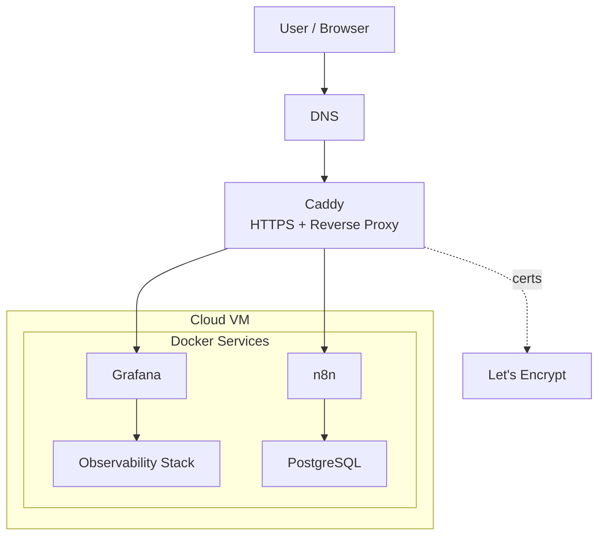

# Lab Infra

Personal self-hosted engineering platform for building and operating applied automation, analytics, and observability in a cloud setup.
Primary goals:
- develop automation workflows
- run analytical experiments
- operate production-like infrastructure
- build reproducible engineering artifacts

## 2. Architecture


| Service           | Port | Purpose                            |
| ----------------- | ---: | ---------------------------------- |
| **n8n**           | 5678 | orchestration automation workflows |
| **Grafana**       | 3000 | dashboards / UI                    |
| **Prometheus**    | 9090 | host/container metrics storage     |
| **Loki**          | 3100 | log storage                        |
| **Node Exporter** | 9100 | host metrics collection            |
| **cAdvisor**      | 8080 | container metrics collection       |
| **PostgreSQL**    | 5432 | operational and analytical storage |
| **Promtail**      |      | log collection                     |
All services run via Docker Compose.

Service interactions:
- n8n uses PostgreSQL as its primary persistence layer
- Prometheus scrapes metrics from Node Exporter and cAdvisor
- Grafana uses Prometheus and Loki as data sources
- Promtail collects Docker logs and sends them to Loki
Persistent data is stored in Docker volumes.

## 4. Quick Start

```bash
git clone <repo>
cd lab-infra
cp .env.example .env # fill required variables
docker compose up -d
```

Verification:
```bash
docker compose ps
curl http://localhost:3000
curl http://localhost:5678
curl http://localhost:9090/-/healthy
curl http://localhost:3100/ready
```

## 6. Access Model

Cloud access:
- `http://104.248.41.116
- ssh root@104.248.41.116
- ssh root@lab-do

**PostgreSQL**
- Internal access: Docker network (n8n → postgres)
- External access: SSH tunnel only
- Direct public access to PostgreSQL is disabled
- Local access (via SSH tunnel):
	- localhost:15432 → server localhost:5432

## 7. Data Model

PostgreSQL runs inside Docker container (`lab-postgres`).
PostgreSQL data is stored in Docker volumes (persistent storage).
**Databases**:
- `n8n` — service database
- `career_upgrade_lab` — analytical database
**Storage**:
- PostgreSQL → Docker volume
- backups → `/opt/backups/postgres`

## 8. Backup Policy

- schedule: daily (cron)
	- databases backup
	- git autocommit+push
- retention: 7 days
- location: `/opt/backups/postgres`
Manual backup:
```bash
./scripts/backup-postgres.sh
./scripts/git-auto-commit.sh
```

## 10. Repository Structure

```text
lab-infra/
├── docker-compose.yml
├── .env.example
├── README.md
├── docs/
│   └── RUNBOOK.md
├── monitoring/
│   ├── loki/
│   ├── prometheus/
│   └── promtail/
├── scripts/
│   ├── backup-postgres.sh
│   └── git-auto-commit.sh
└── .obsidian/
```

## 11. Configuration

All environment variables are defined in `.env`.
Template:
```env
POSTGRES_USER=admin
POSTGRES_PASSWORD=<password>
POSTGRES_DB=n8n

GRAFANA_ADMIN_USER=admin
GRAFANA_ADMIN_PASSWORD=<password>

SERVER_IP=<ip>
```
Do not commit `.env`.

## 12. Operations

Operational procedures are described in:
`docs/RUNBOOK.md`
Includes:
- health checks
- restart procedures
- logs inspection
- backup and restore
