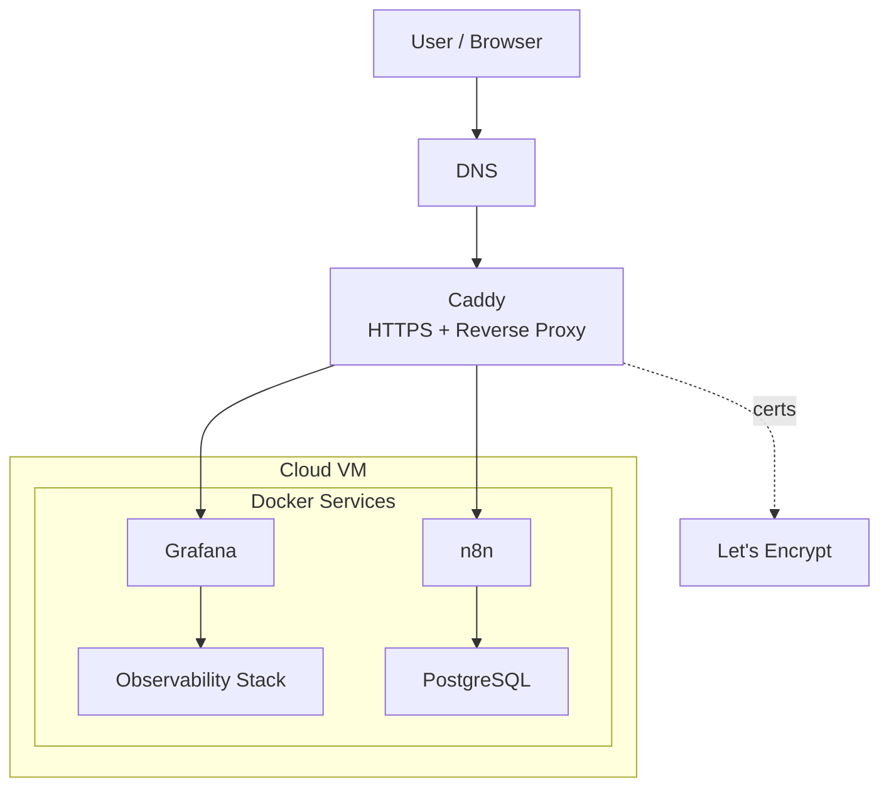

# Lab Infra

Personal self-hosted engineering platform for building and operating applied automation, analytics, and observability in a cloud setup.
Primary goals:
- develop automation workflows
- run analytical experiments
- operate production-like infrastructure
- build reproducible engineering artifacts

## 1. Architecture

- `n8n.samandrey.work` → `Caddy` → `n8n`
- `grafana.samandrey.work` → `Caddy` → `oauth2-proxy-grafana` → `Grafana`
- `https://n8n.samandrey.work/rest/oauth2-credential/callback` → `Caddy` → `n8n`

| Service           | Port | Purpose                            |
| ----------------- | ---: | ---------------------------------- |
| **n8n**           | 5678 | orchestration automation workflows |
| **Grafana**       | 3000 | dashboards / UI                    |
| **Prometheus**    | 9090 | host/container metrics storage     |
| **Loki**          | 3100 | log storage                        |
| **Node Exporter** | 9100 | host metrics collection            |
| **cAdvisor**      | 8080 | container metrics collection       |
| **PostgreSQL**    | 5432 | operational and analytical storage |
| **Promtail**      |      | log collection                     |
All services run via Docker Compose.

Service interactions:
- n8n uses PostgreSQL as its primary persistence layer
- Prometheus scrapes metrics from Node Exporter and cAdvisor
- Grafana uses Prometheus and Loki as data sources
- Promtail collects Docker logs and sends them to Loki
Persistent data is stored in Docker volumes.

## 2. Quick Start

```bash
git clone <repo>
cd lab-infra
cp .env.example .env # fill required variables
docker compose up -d
```

Verification:
```bash
- infrastructure:
    - docker compose ps
    - docker logs ...
- external:
	# Проверка DNS (первый шаг!)  
	nslookup n8n.samandrey.work  
	nslookup grafana.samandrey.work  
	  
	# Проверка через Caddy локально (без DNS)  
	curl -vk --resolve n8n.samandrey.work:443:127.0.0.1 https://n8n.samandrey.work  
	curl -vk --resolve grafana.samandrey.work:443:127.0.0.1 https://grafana.samandrey.work  
	  
	# Проверка backend (внутри docker)  
	docker exec lab-caddy wget -qO- http://n8n:5678 | head  
	docker exec lab-caddy wget -qO- http://grafana:3000 | head
- internal:
    - docker exec ... wget http://n8n:5678
    - curl http://localhost:9090/-/healthy
    - curl http://localhost:3100/ready
```

## 3. Access Model

**Cloud access:**
- `http://104.248.41.116`
- ssh root@104.248.41.116
- ssh root@lab-do

**Domens**:
- `n8n.samandrey.work`
- `grafana.samandrey.work`
- `oauth2.samandrey.work`

**Google OAuth:**
- Google OAuth is used in two different roles:
	- for UI login via oauth2-proxy
	- for credentials within n8n
- these are two different OAuth flows
- for credentials within n8n, the callback path /rest/oauth2-credential/callback should not be intercepted by oauth2-proxy


**PostgreSQL**
- Internal access: Docker network (n8n → postgres)
- External access: SSH tunnel only
- Direct public access to PostgreSQL is disabled
- Local access (via SSH tunnel):
	- localhost:15432 → server localhost:5432

## 4. Data Model

PostgreSQL runs inside Docker container (`lab-postgres`).
PostgreSQL data is stored in Docker volumes (persistent storage).
**Databases**:
- `n8n` — service database
- `career_upgrade_lab` — analytical database
**Storage**:
- PostgreSQL → Docker volume
- backups → `/opt/backups/postgres`

## 5. Backup Policy

- schedule: daily (cron)
	- databases backup
	- git autocommit+push
- retention: 7 days
- location: `/opt/backups/postgres`
**Manual backup**:
```bash
./scripts/backup-postgres.sh
./scripts/git-auto-commit.sh
```

## 6. Repository Structure

```text
├── README.md
├── caddy
│   └── Caddyfile
├── docker-compose.yml
├── docs
│   └── RUNBOOK.md
├── monitoring
│   ├── loki
│   │   └── config.yml
│   ├── prometheus
│   │   └── prometheus.yml
│   └── promtail
│       └── config.yml
├── scripts
│   ├── backup-postgres.sh
│   └── git-auto-commit.sh
└── test.js
```

## 7. Configuration

All environment variables are defined in `.env`.
Template:
```env
POSTGRES_USER=admin
POSTGRES_PASSWORD=<pass>
POSTGRES_DB=n8n

GRAFANA_ADMIN_USER=admin
GRAFANA_ADMIN_PASSWORD=<pass>

GOOGLE_OAUTH_CLIENT_ID=277350617242-58c8s8dmj9j0sv1m8acj26kh33e0fp26.apps.googleuserc>
GOOGLE_OAUTH_CLIENT_SECRET=<secret>

OAUTH2_PROXY_GRAFANA_COOKIE_SECRET=<secret>
OAUTH2_PROXY_N8N_COOKIE_SECRET=<secret>
ALLOWED_EMAIL=samojlov.andrey@gmail.com

SERVER_IP=104.248.41.116

N8N_SECURE_COOKIE=true
N8N_ENCRYPTION_KEY=<key>
```
Do not commit `.env`.

## 8. Operations

Operational procedures are described in:
`docs/RUNBOOK.md`
Includes:
- health checks
- restart procedures
- logs inspection
- backup and restore
