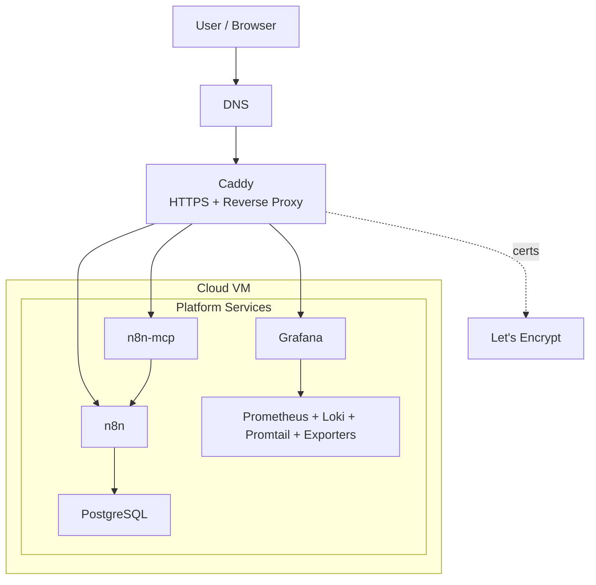

# Lab Infra

Self-hosted platform repository for the lab runtime itself.

This repo is intentionally limited to deployed platform services used to
spin up and operate new projects:

- `n8n`
- `postgres`
- `n8n-mcp`
- `caddy`
- `grafana`
- `prometheus`
- `loki`
- `promtail`
- `node-exporter`
- `cadvisor`

It does not store business/project implementations. Product-specific
flows, parsers, analytics services, datasets, and experiments should live
in their own project repositories.

## Scope boundary

Allowed in this repo:

- platform compose and reverse-proxy config
- monitoring and backup configuration
- shared operational scripts
- MCP connectivity/config generation

Not allowed in this repo:

- Wildberries, MP Cockpit, WB Genius, weather, job-searcher, or any other
  project-specific code
- project datasets, research notes, exports, or test payloads
- service implementations that exist only to support a single project

See `docs/REPOSITORY-BOUNDARY.md` for the working rule.

## Architecture


```mermaid
flowchart TB
    user["User / Browser"]
    dns["DNS"]
    caddy["Caddy<br/>HTTPS + Reverse Proxy"]

    subgraph vm["Cloud VM"]
        subgraph docker["Platform Services"]
            grafana["Grafana"]
            n8n["n8n"]
            n8nMcp["n8n-mcp"]
            observability["Prometheus + Loki + Promtail + Exporters"]
            postgres["PostgreSQL"]
        end
    end

    le["Let's Encrypt"]

    user --> dns --> caddy
    caddy --> grafana
    caddy --> n8n
    caddy --> n8nMcp
    grafana --> observability
    n8n --> postgres
    n8nMcp --> n8n
    caddy -. certs .-> le
```

- `n8n.samandrey.work` -> `Caddy` -> `n8n`
- `n8n-tech.samandrey.work` -> `Caddy` -> `n8n`
- `n8n-mcp.samandrey.work` -> `Caddy` -> `n8n-mcp`
- `grafana.samandrey.work` -> `Caddy` -> `oauth2-proxy-grafana` -> `Grafana`

## Quick start

```bash
git clone <repo>
cd lab-infra
cp .env.example .env
docker compose up -d
python3 scripts/render-mcp-configs.py --check
```

Optional local overlay for private experiments:

```bash
cp services/.env.example services/.env
docker compose -f services/docker-compose.yml --env-file services/.env up -d --build
```

The canonical repo ships with an empty `services/docker-compose.yml`.
If you need a project-specific service, keep it local-only or move it to a
separate project repo.

## Access model

- SSH: `root@lab-do`
- Domains: `n8n.samandrey.work`, `n8n-tech.samandrey.work`,
  `n8n-mcp.samandrey.work`, `grafana.samandrey.work`
- PostgreSQL: internal Docker access by default; external access via SSH
  tunnel only

## Repository structure

```text
.
├── README.md
├── caddy/
├── docker-compose.yml
├── docs/
├── mcp/
├── monitoring/
├── scripts/
└── services/
```

## Operations

Operational procedures live in `docs/RUNBOOK.md`.
MCP client configuration lives in `mcp/` and is generated from
`mcp/servers.json`.

## Backup policy

- Daily database backup
- Daily local git safety snapshot
- Local-only recovery branch: `auto-snapshots`

Manual commands:

```bash
./scripts/backup-postgres.sh
./scripts/git-auto-commit.sh
```
| grafana       | `grafana/grafana-oss`                    | `10.2.3`   |
| oauth2-proxy  | `quay.io/oauth2-proxy/oauth2-proxy`      | `v7.15.1`  |
| prometheus    | `prom/prometheus`                        | `v3.10.0`  |
| loki          | `grafana/loki`                           | `3.0.0`    |
| promtail      | `grafana/promtail`                       | `3.0.0`    |
| node-exporter | `prom/node-exporter`                     | `v1.10.2`  |
| cadvisor      | `gcr.io/cadvisor/cadvisor`               | `v0.55.1`  |

The `v` prefix matches the vendor's own tag scheme on the registry — some projects use it (prom/*, cadvisor, oauth2-proxy), others don't (n8n, postgres, caddy, grafana, loki).

The `n8n-mcp` service is pinned by digest in `docker-compose.yml`. To bump it, use the image-pin procedure in `docs/RUNBOOK.md` and do not move back to a floating `:latest` tag.

### Upgrade policy: MANUAL, per service

Images are **not** auto-upgraded. Running `docker compose pull` without a tag change is intentionally a no-op. To upgrade a service:

1. Review the upstream changelog / release notes for the target version. Check for breaking changes (auth schema, config format, DB migrations).
2. Edit the tag in `docker-compose.yml` in a focused commit (`chore(deps): bump <service> X -> Y`, with the changelog link in the commit body).
3. `docker compose pull <service>` — fetch the new image.
4. `docker compose up -d <service>` — restart only that service.
5. Verify: service health check, UI login, a sanity workflow run, relevant logs clean.
6. On regression: revert the tag in git, `docker compose up -d <service>` to roll back.

Security patches: watch the upstream release pages (GitHub releases, CVE feeds) for each pinned version. Apply on review, not automatically.

**Why not `:latest`**: an automatic pull on restart can pick up a new major, break auth/UI/schema, and leave the platform in an unbootable state with no correlation to when the breakage started. Pinning makes upgrades a deliberate, reviewable action.

**Current upgrade debt** (tracked separately in the project context file):

- Grafana `10.2.3` is EOL — plan migration to `11.x`.
